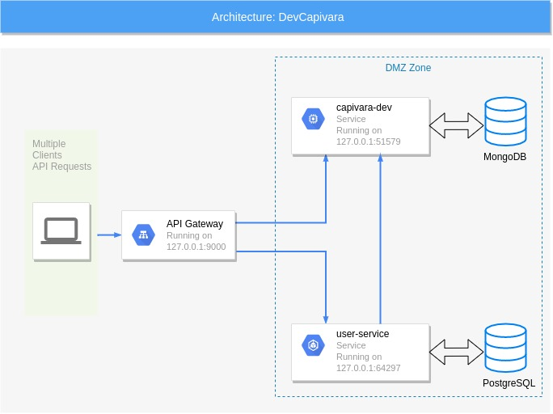

# DevCapivara Microservices

Este projeto foi construído para a aula de Scala e
Microserviços disponibilizado via Podcast e Live 
pelo [DevCapivara](https://devcapivara.com.br) no dia 25/03/2020.

## Objetivo

Se trata de uma aplicação baseada em microserviços
escrita em Scala com componente Lagom, onde os usuários podem cadastrar as suas Capivaras.
Dessa forma cada usuário pode ter várias ou nenhuma
capivara.

## Arquitetura

A aplicação consiste em três serviços:

- **dev-capivara**: Serviço responsável pelo provisionamento
das capivaras, onde são salvas no MongoDB.
- **user-service**: Onde os usuários podem se registrar no PostgreSQL.
- **API Gateway**: Entrada de todas as requisições 
para a aplicação.

A API Gateway recebe a requisição e pode encaminhar para um ou
outro serviço. o serviço de **user-service** requisita
o **dev-capivara** sempre que vai exibir as capivaras de
um usuário.

Desenho da aplicação:



## Como rodar o projeto

Com Java 8 e SBT instalados, inicie o docker-compose e inicie o Lagom:
>`docker-compose up -d --build`

>`sbt runAll`

## Endpoints

##### GET - ```/gateway/api/capivara``` - Retorna todas as capivaras.

##### GET - ```/gateway/api/users``` - Retorna todos os usuários.

##### POST - ```/gateway/api/users``` - Adiciona um novo usuário.
Modelo do entrada:
```
{
    "name": "Diego",
    "email": "diegofelima.ti@gmail.com"
}
```

##### POST - ```/gateway/api/user/:id``` - Adiciona uma capivara para o usuário do ID.
Modelo do entrada:
```
{
    "name": "Capivara",
    "age": 2,
    "color": "marrom"
}
```

## Outras informações

> Link para a Live: [Link Youtube](https://www.youtube.com/watch?v=SR_DFsclZkw)
